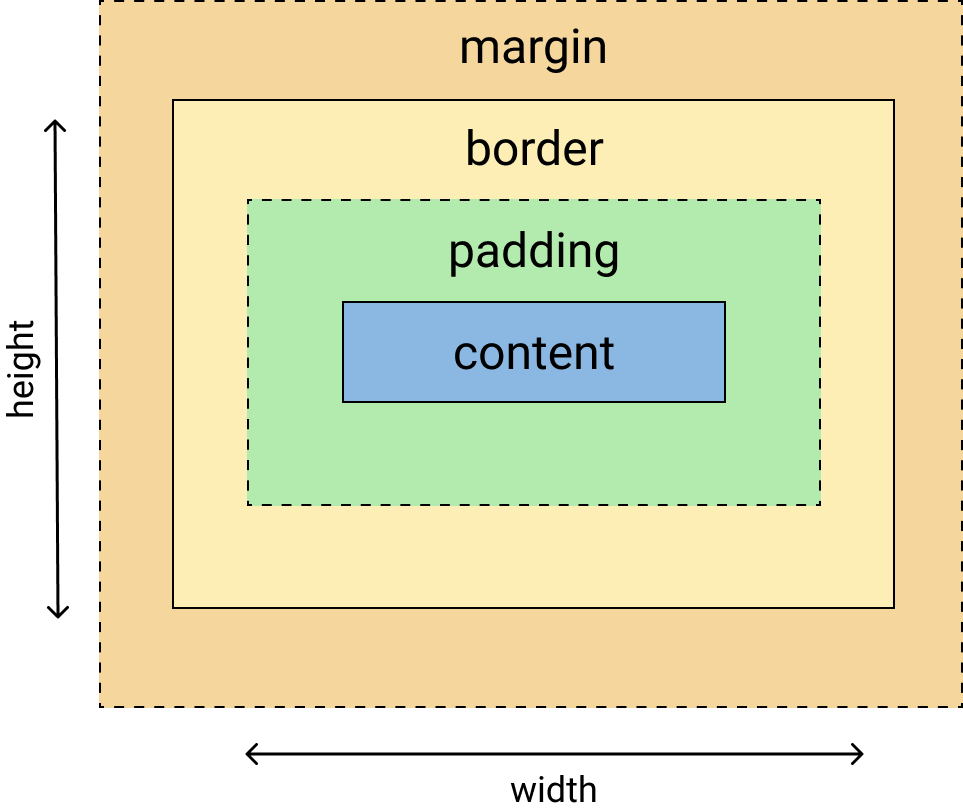
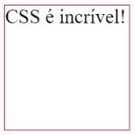
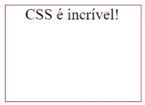
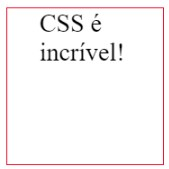

# Uma caixa dentro da outra

Box-Model - 7 aulas - 33:12  
01 - Abertura - 00:20  
02 - Introdução - 02:07  
03 - Box Sizing - 05:22  
04 - Display-block-inline - 06:43  
05 - Margin - 08:44  
06 - Padding - 03:02  
07 - Border-outline - 06:54  

## Box Model

* Fundamental para fazer layouts para a web
* Maior facilidade para aplicar o CSS

## O que é?

Uma caixa retangular.
Essa caixa possui propriedades de uma caixa (2D)

* Tamanho (largura x altura)          width | height  
* Conteúdo → content                  content  
* Bordas → border                     border  
* Preenchimento interno → padding     padding  
* Espaços fora da caixa → margin      margin  

*Cada elemento na sua página, será considerado uma caixa.*



## box-sizing

Como será calculado o tamanho total da caixa?

* content-box|border-box
  
```css
div {
  box-sizing: border-box;
}
```

### Exemplo:

#### HTML

```html
<div>
  css é incrível!
</div>
```
___

#### CSS

```css
div {
  width: 100px;
  height: 100px;
  border: 1px solid red;
  margin: 10%;
}
```



___

#### CSS

Quando o padding é adicionado (`padding: 0 20px;`) faz com que aumente a largura da caixa, deixando de respeitar os 100px de largura:


```css
div {
  width: 100px;
  height: 100px;
  border: 1px solid red;
  margin: 10%;
  padding: 0 20px;
}
```



___

#### CSS

Por padrão o navegador vai calcular o tamanho da caixa pelo `content-box` e vai somar com os outros boxes, no exemplo acima no lugar de 100px a caixa vai ficar com uma largura de 140px. Para que isso não aconteça, é possível mudar qual vai ser a referência para o calculo do tamanho da caixa adicionando a propriedade `box-sizing: border-box;`.  

Dessa forma o elemento vai ficar com a largura (width) determinado, que no caso do exemplo citado é de 100px.


```css
div {
  width: 100px;
  height: 100px;
  border: 1px solid red;
  margin: 10%;
  padding: 0 20px;
  box-sizing: border-box;
}
```



## display: block vs display: inline

* Como as caixas se comportam em relação às outras caixas  
* Comportamento externo das caixas

|            **block**             |           **inline**           |
|----------------------------------|-------------------------------|
| Ocupa toda a linha, colocando o próximo elemento abaixo desse | Elemento ao lado do outro    |
| width e height são respeitados   | width e heigth não funcionam  |
| padding, margin, border irão funcionar normalmente. | Somente valores horizontais de margin, padding e border |

exemplos  
block: `<p> <div> <section>`, todos os headings `<h2></h2>...`  
inline: `<span> <strong> <em> <a> <b>`  

## margin

Espaços entre os elementos  

Podemos dividir o margin em 4 valores:  

`margin-top | margin-right | margin-bottom | margin-left`  
values: `<length>` | `<percentage>` | auto  

Geralmente usamos uma forma abreviada (**shorthand**) para escrever o **margin**. Esse formato segue o sentido horário iniciando pelo `top`, seguindo para `right`, `bottom` e `left`.  

```css
margin: 12px 16px 10px 4px; /* TOP = 12px | RIGHT = 16px | BOTTOM = 10px | LEFT = 4px */  
margin: 12px 16px 0; /* TOP = 12px | RIGHT = 16px | BOTTOM = 0px | LEFT = 16px */  
margin: 8px 16px; /* TOP = 8px | RIGHT = 16px | BOTTOM = 8px | LEFT = 16px */  
margin: 8px; /* TOP = 8px | RIGHT = 8px | BOTTOM = 8px | LEFT = 8px */
```

O margin é aplicado em elementos com display block  

Cuidado com o margin collapsing que é quando o top se junta ao bottom  

<https://developer.mozilla.org/en-US/docs/Web/CSS/margin>

## padding

Preenchimento interno da caixa  

`padding-top | padding-right | padding-bottom | padding-left`  
values: `<length>` | `<percentage>`  

Geralmente usamos uma forma abreviada (**shorthand**) para escrever o **margin**. Esse formato segue o sentido horário iniciando pelo `top`, seguindo para `right`, `bottom` e `left`.  

```css
padding: 12px 16px 10px 4px; /* TOP = 12px | RIGHT = 16px | BOTTOM = 10px | LEFT = 4px */  
padding: 12px 16px 0; /* TOP = 12px | RIGHT = 16px | BOTTOM = 0px | LEFT = 16px */  
padding: 8px 16px; /* TOP = 8px | RIGHT = 16px | BOTTOM = 8px | LEFT = 16px */  
padding: 8px; /* TOP = 8px | RIGHT = 8px | BOTTOM = 8px | LEFT = 8px */
```

O padding pode ter valores (values) de comprimento (px, em, rem) ou de porcentagem (%)  

O padding poderá causar diferença na largura de um elemento.  
obs.: Na aula sobre `box-xizing` aprendemos como resolver essa diferença na largura do elemento  

<https://app.rocketseat.com.br/node/uma-caixa-dentro-da-outra/lesson/box-sizing>

## border ( e outline )

As bordas da caixa  

* value: `<border-style>` | `<border-width>` | `<border-color>`

* style: solid | dotted | dashed | double | groove | ridge | inset | outset  

* width: `<length>`
* color: `<color>`

```css
div {
  /* shorthand */
  border-top: solid 2px; /* top | right | bottom | left */

  /* style */
  border: solid;

  /* width <length> | style */
  border: 2px dotted;

  /* style | color */
  border: outset #f33;

  /* width | style | color */
  border: medium dashed green;
}
```

E o outline?  

O **outline** é muito semelhante ao **border**, mas difere em 4 sentidos:  

* Não modifica o tamanho da caixa, pois não é parte do Box Model  
* Poderá ser diferente de retangular  
* Não permite ajuste individuais  
* Mais usado pelo user agent para acessibilidade  

Documentação do MDN: <https://developer.mozilla.org/en-US/docs/Web/CSS/border>
